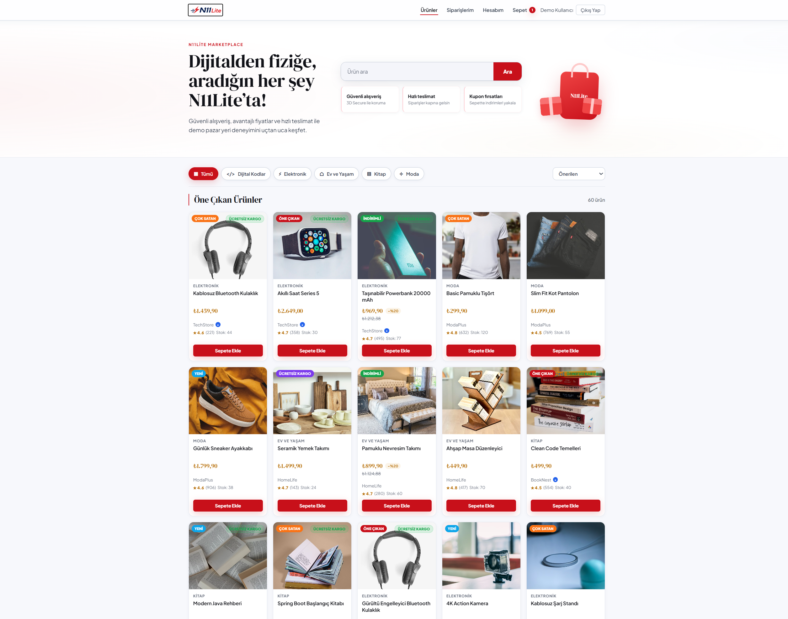
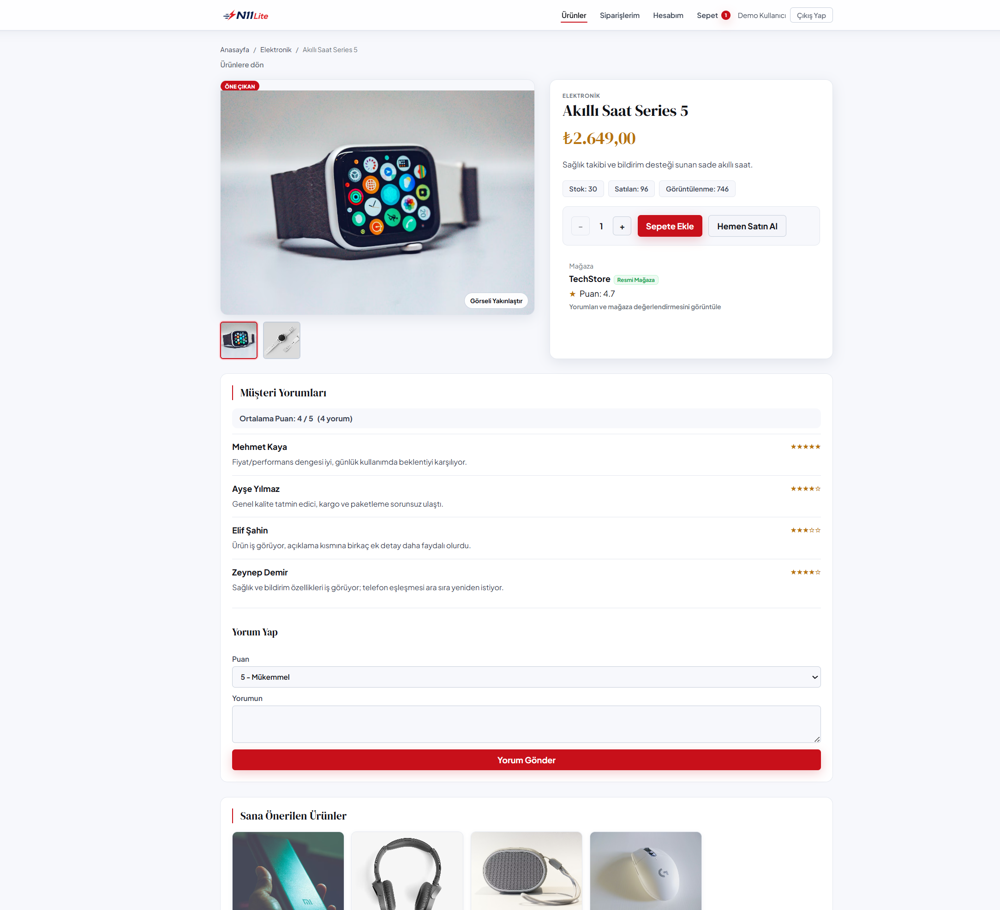
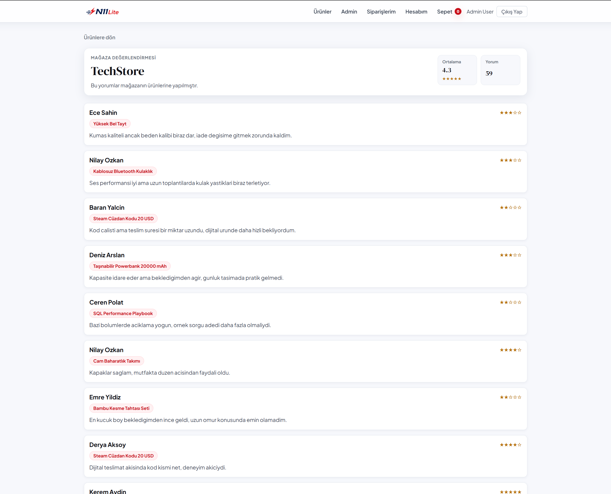
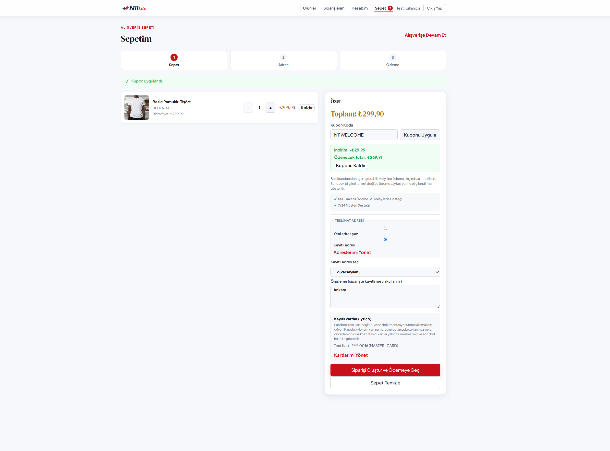
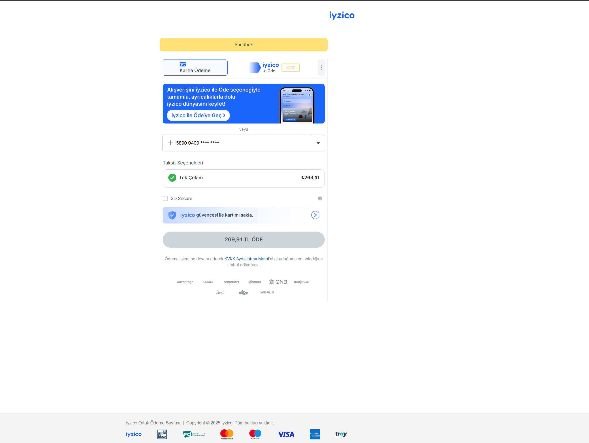
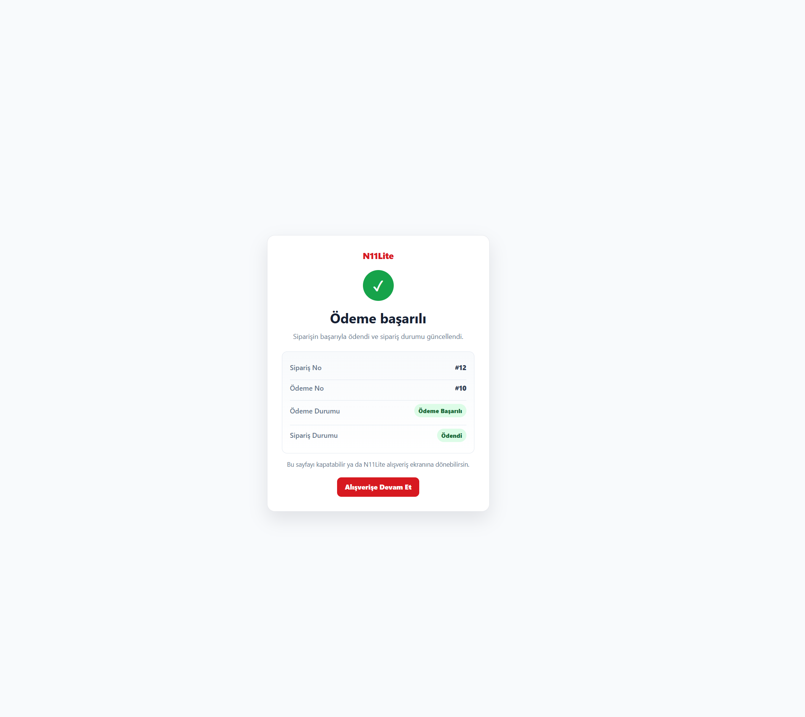
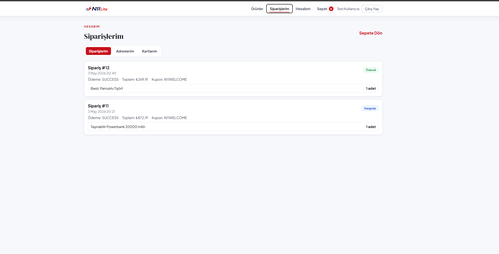
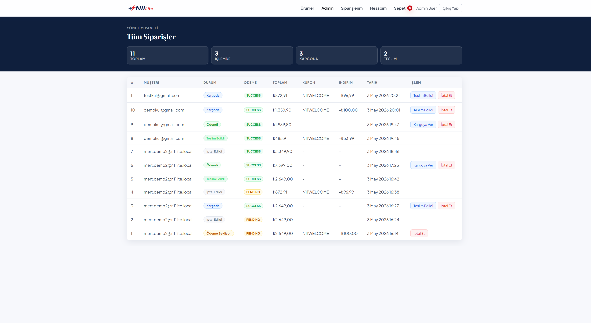

# N11Lite Marketplace

N11Lite Marketplace is a bootcamp final project built as a demo marketplace/e-commerce app with Spring Boot, React, PostgreSQL, and Docker Compose.

The project focuses on a clean layered backend, a usable React frontend for product/auth/cart flows, and demo-friendly local development tools.

## Project Purpose

This project simulates a small marketplace flow:

- users can register and log in with email verification
- products can be listed and viewed in detail
- authenticated users can manage their cart
- orders can be created from the cart UI or through the backend API
- payment can be started from the cart UI through the backend Iyzico sandbox flow
- users can apply demo coupons, write product reviews, and receive simple product recommendations
- admins can manage order statuses from a small admin panel

The frontend keeps payment simple: it starts the Iyzico Checkout Form redirect flow and lets the user check payment status. It does not collect card details.

## Tech Stack

Backend:

- Java 21
- Spring Boot 3
- Spring Security + JWT
- Spring Data JPA
- PostgreSQL
- Flyway
- Mailpit for local email testing
- Iyzico Java SDK
- Swagger/OpenAPI with springdoc
- Jib for backend container image builds

Frontend:

- React
- Vite
- Axios
- React Router

DevOps/local tools:

- Docker Compose
- GitHub Actions
- Jib

## Core Features

- Product listing
- Product detail page
- JWT authentication
- Email verification login flow
- Local email testing with Mailpit
- Shopping cart frontend and backend
- Coupon validation and cart discount display
- Order creation frontend and backend API
- Iyzico payment initiation and status flow
- Iyzico sandbox Checkout Form with installment option display
- Product reviews and ratings
- Store review summary
- Session-based product recommendations
- Saved address and masked saved-card demo flow
- Admin order management panel
- Swagger/OpenAPI documentation
- Lightweight backend logging
- Docker Compose for PostgreSQL and Mailpit
- GitHub Actions build/test pipeline
- Deployment plan documentation

## Project Highlights

- Two-step login with email verification code
- Local Mailpit inbox for welcome and verification emails
- Backend Iyzico sandbox checkout flow
- Coupon, review, recommendation, and admin flows for a more complete marketplace demo
- Jib image build without writing a Dockerfile
- CI/CD and deployment notes for GitHub Actions, Jenkins, AWS Elastic Beanstalk, RDS, and Slack notifications

## Screenshots

### Marketplace Home



### Product Detail



### Store Reviews



### Cart and Checkout



### Iyzico Sandbox Payment



### Payment Success



### Customer Orders



### Admin Order Management



## Architecture Summary

Backend follows a simple layered structure:

- Controller: HTTP endpoints and request/response handling
- Service: business logic
- Repository: database access
- DTO: request and response models
- Mapper: explicit entity-to-response mapping
- Flyway migrations: database schema and seed data

Controllers return DTOs, not entities. Business logic stays in services.

## Local URLs

- Frontend: http://localhost:5173
- Backend: http://localhost:8080
- Swagger UI: http://localhost:8080/swagger-ui/index.html
- Mailpit UI: http://localhost:8025

## Admin Demo User

Local demo admin panel:

```text
http://localhost:5173/admin/orders
```

Local demo admin credentials only:

```text
email: admin@n11lite.com
password: N11LiteAdmin2026!
```

## Demo Customer Users

Seeded local demo users can be used if you do not want to register a new account during a demo:

```text
email: mert.demo2@n11lite.local
password: password
```

Alternative:

```text
email: ayse.demo@n11lite.local
password: password
```

These are local seed users only and should not be treated as production credentials.

## Docker Compose Services

Start local PostgreSQL and Mailpit:

```powershell
docker compose up -d postgres mailpit
```

Start the full stack (PostgreSQL + Mailpit + Backend + Frontend):

```powershell
docker compose up -d --build
```

Stop all services:

```powershell
docker compose down
```

View backend/frontend logs:

```powershell
docker compose logs -f backend frontend
```

Local database defaults:

- Database: `n11_marketplace`
- User: `n11_dev_user`
- Password: `n11_dev_password`

Mailpit:

- SMTP: `localhost:1025`
- Web inbox: http://localhost:8025

## Backend Setup

```powershell
cd backend
.\mvnw.cmd spring-boot:run
```

Backend runs on:

```text
http://localhost:8080
```

Swagger/OpenAPI:

```text
http://localhost:8080/swagger-ui/index.html
```

## Frontend Setup

```powershell
cd frontend
npm install
npm run dev
```

Frontend runs on:

```text
http://localhost:5173
```

## Iyzico Payment Notes

The project has an Iyzico Checkout Form flow for demo/sandbox usage. Local development can run without Iyzico credentials; in that case the app shows a friendly payment configuration message.

The checkout screen is handled by Iyzico. Card entry, 3D Secure/SMS simulation, and installment options are displayed on the Iyzico sandbox page, not inside the React frontend.

Iyzico credentials are read from environment variables:

- `IYZICO_API_KEY`
- `IYZICO_SECRET_KEY`
- `IYZICO_BASE_URL`
- `IYZICO_CALLBACK_URL`

Example sandbox configuration shape:

```powershell
$env:IYZICO_API_KEY="sandbox-api-key"
$env:IYZICO_SECRET_KEY="sandbox-secret-key"
$env:IYZICO_BASE_URL="https://sandbox-api.iyzipay.com"
$env:IYZICO_CALLBACK_URL="https://PUBLIC-BACKEND-URL/api/payments/iyzico/callback"
```

Do not store real or sandbox credentials in the repository. Iyzico sandbox uses Iyzico test cards, not real cards. Localhost callback URLs may not work for the full payment completion flow unless the backend is exposed through a public tunnel.

### Saved cards (security note)

- Full card number and CVV are not stored in the application database.
- Saved cards are displayed with masked information (for example, last four digits).
- When available, Iyzico `cardUserKey` / card token identifiers are used for the saved-card flow instead of persisting PAN/CVV.
- For manual testing in sandbox, enter test card details yourself; do not rely on pre-filled card numbers in the UI.

## API Highlights

Public endpoints:

- `GET /api/health`
- `GET /api/categories`
- `GET /api/products`
- `GET /api/products/{slug}`
- `GET /api/products/{slug}/reviews`
- `GET /api/recommendations`
- `POST /api/recommendations/views/{slug}`
- `POST /api/auth/register`
- `POST /api/auth/login`
- `POST /api/auth/verify-login`

Authenticated endpoints:

- `GET /api/auth/me`
- `GET /api/cart`
- `POST /api/cart/items`
- `PUT /api/cart/items/{itemId}`
- `DELETE /api/cart/items/{itemId}`
- `DELETE /api/cart/items`
- `POST /api/coupons/validate`
- `POST /api/orders`
- `GET /api/orders`
- `GET /api/orders/{orderId}`
- `POST /api/payments/orders/{orderId}/checkout`
- `GET /api/payments/orders/{orderId}`
- `POST /api/products/{slug}/reviews`

Admin endpoints:

- `GET /api/admin/orders`
- `GET /api/admin/orders/{orderId}`
- `PUT /api/admin/orders/{orderId}/status`

Payment callback:

- `POST /api/payments/iyzico/callback`

## Demo Flow

1. Start PostgreSQL and Mailpit.

```powershell
docker compose up -d postgres mailpit
```

2. Start backend.

```powershell
cd backend
.\mvnw.cmd spring-boot:run
```

3. Start frontend.

```powershell
cd frontend
npm install
npm run dev
```

4. Open frontend:

```text
http://localhost:5173
```

5. Register a new user.
6. Check welcome email in Mailpit.
7. Login with email and password.
8. Check verification code email in Mailpit.
9. Verify login with the code.
10. Browse products and open product detail.
11. Check product reviews, store review information, and recommendations.
12. Add product to cart and update cart.
13. Apply a demo coupon such as `N11WELCOME` if the cart total meets the minimum amount.
14. Create order from the cart page by entering a shipping address.
15. Start the Iyzico payment flow from the cart page.
16. If sandbox credentials are missing, confirm the friendly configuration message.
17. Login as the demo admin user and update order status from the admin panel.
18. Use Swagger for API documentation and manual endpoint testing.

## Testing and Build

Backend tests:

```powershell
cd backend
.\mvnw.cmd clean test
```

Frontend production build:

```powershell
cd frontend
npm run build
```

Jib backend image build:

```powershell
cd backend
.\mvnw.cmd jib:dockerBuild
```

## CI/CD and Deployment

CI/CD and deployment notes are in [docs/deployment.md](docs/deployment.md).

The project includes:

- GitHub Actions CI for backend tests and frontend build
- Jib configuration for backend container image builds
- Deployment plan for AWS Elastic Beanstalk + RDS
- Jenkins comparison
- Slack notification plan

This repository does not claim a live AWS deployment. The AWS section is a deployment plan for the final project.

For the final demo, the project is intended to run locally with Docker Compose. The deployment-related files and documentation show deployment readiness, but the recorded demo does not depend on a live cloud deployment.

## Development Discipline

The project uses a clean layered architecture with DTO responses instead of returning entities directly. Development was kept in small commits, with backend tests and frontend builds checked before approved commits.
